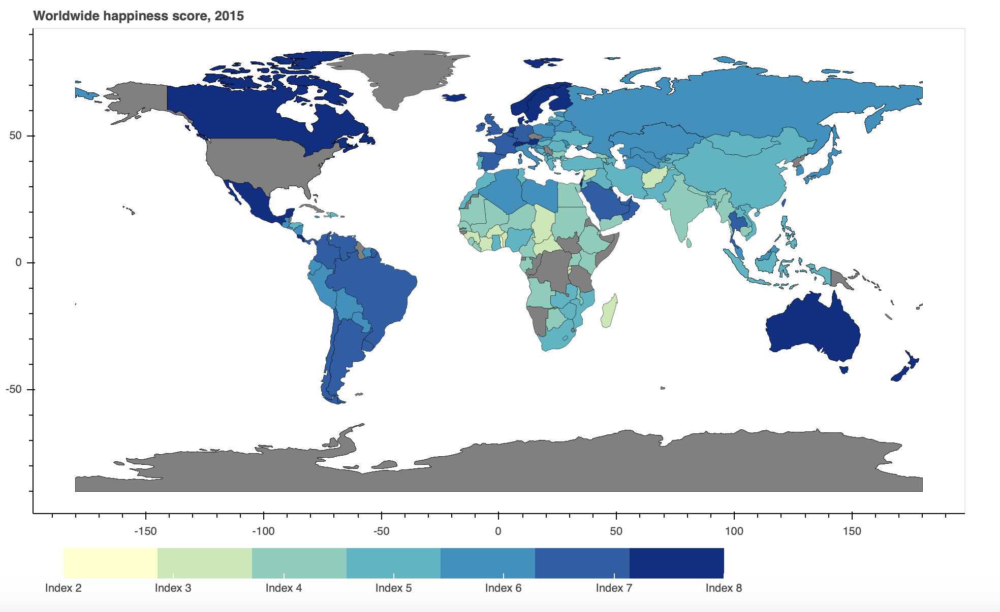
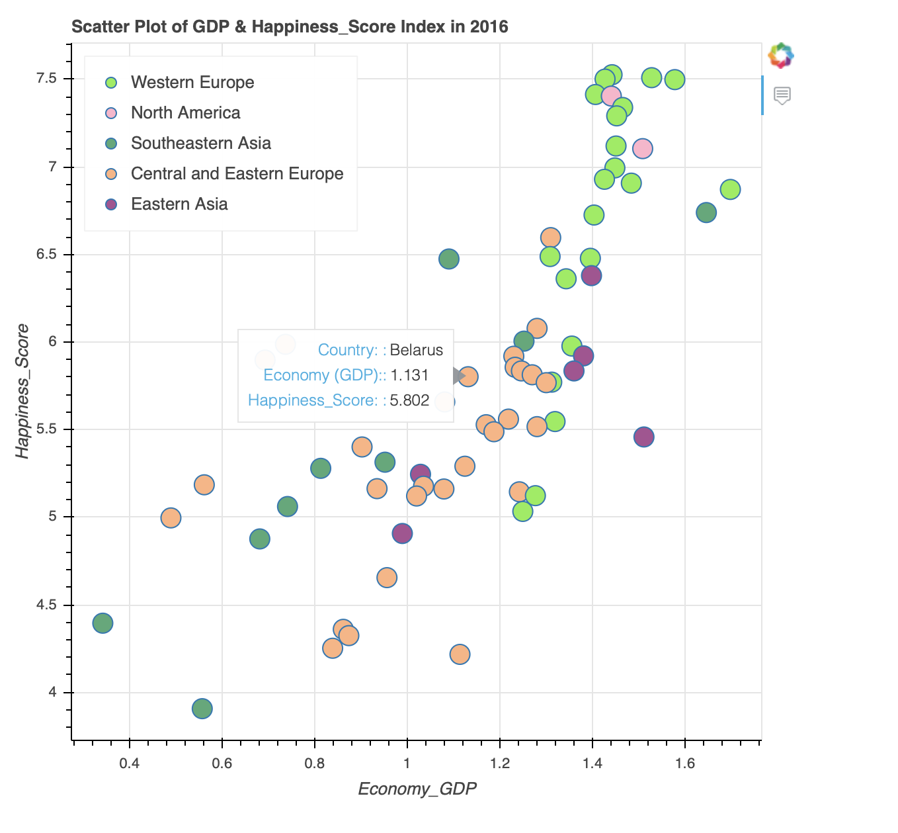
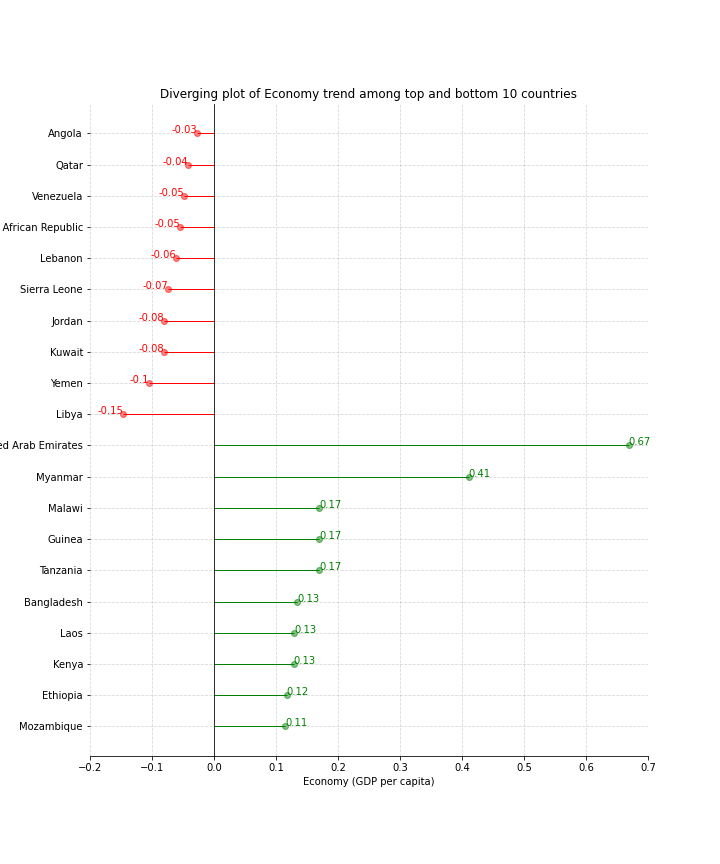
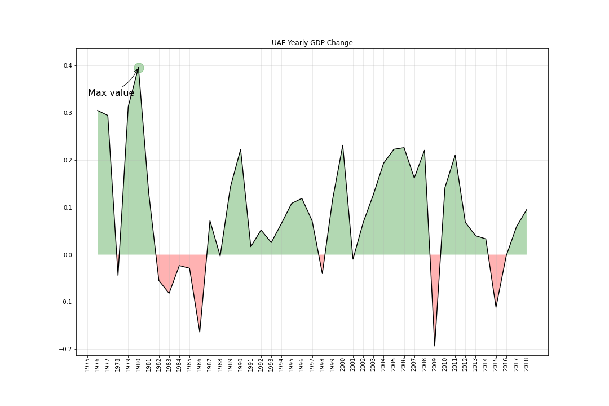

# EDA: Visualization in Geopandas, Matplotlib & Bokeh

**Blog Post Link:** https://towardsdatascience.com/eda-visualization-in-geopandas-matplotlib-bokeh-9bf93e6469ec

## Code Files
- Jupyter files **Bokeh_Static.ipynb**
  - Static choropleth map for year 2015
- Jupyter files **Analytics_Plot.ipynb**
  - Analytics on worldwide dataset from 2016 to 2019
- Python files **EDA_Plot.py**
  - Command: **bokeh serve --show EDA_Plot.py**
  - Dynamic choropleth Plot from 2016 to 2019

## Bokeh_Static Plot
### 1. Static choropleth map for year 2015
### Analytics:
From the plot below, we see that countries like Canada, Mexico, and Australia have a higher happiness score. For South America, and European countries, the overall score is distributed around Index 5 and 6. In Contrast, African countries like Niger, Chad, Mali, and Benin show a much lower happiness index.

### 2. Scatter Plot of GDP & Happiness_Score Index in 2016
### Analytics:
We look into the correlation of GDP Growth and happiness levels score in 2016. As the countries are color-coded by regions, we can see that southeast countries have lower GDP growth followed by underlying happiness scores. Most countries in central and eastern Europe have GDP growth fall within 0.8 and 1.4 with a happiness score between 5 and 6. For the region of Western Europe, they tend to show a higher range of economic growth along with the happiness index.

### 3. Top and Bottom 10 Countries of Economy Index (GDP per capita)
### Analytics:
For the top 10 economy trend countries, ‘United Arab Emirate’ has shown the increasing trend with 0.68 growth on the economy from 2015 to 2018. ‘Myanmar’ has a rising rate with 0.41 on GDP per Capita growth as one only Asian country. Surprisingly, Sub-Saharan Africa countries like ‘Malawi’, ‘Guinea’, ‘Tanzania’ are the top 5 countries with the upward economic trend.\
We can see that countries with decreased economic trends are mostly in Africa. Bottom 5 countries like ‘Libya’, ‘Yemen’, ‘Kuwait’, ‘Jordan’, ‘Sierra Leone’ have lower Economy Index from 2015 to 2018. Four of those countries are located in the Middle East and Northern Africa.

### 4. UAE Yearly GDP Change
### Analytics:
Seeing the top and Bottom 10 Countries of Economy Index (GDP per capita growth), we closely look into the United Arab Emirate’s economic trend. In 1980, UAE shows the max GDP growth value among 40 years. However, the growth becomes negative in the range of the year 1982 to 1986. In the next 10 years, UAE shows a quite stable GDP growth around 0.1 to 0.2 rise. In the year 2009, there’s a plunge on GDP growth followed by the impact of the financial crisis.

### References:
- Kaggle (Plotting with Python: learn 80 plots STEP by STEP),  https://www.kaggle.com/python10pm/plotting-with-python-learn-80-plots-step-by-step#Plot-11:-Diverging-lines-with-text
