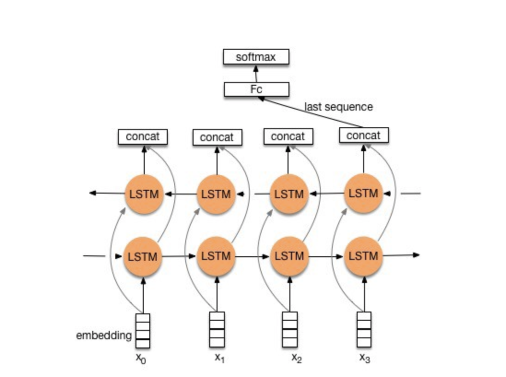

# Sentiment Analysis Project

## Bi-LSTM Sentiment Analysis model (Binary Classification)
### Preprocessing
- remove HTML tags
- remove stopwords
- remove punctuation
- Stemming: improve structure of text

### Text features for deep learning model
- tokenize sentences
- tranform tokenized text into integers
- **pad sequences:** All text inpute features have same length
- Interger encoded text data for embedding layer
- transforms text data into embedding layer for deep learning Model

### Deep Learning Model

- ``Embedding(1000, 100 ,input_length=800)``
   - input words have 800 in each document
   - vocab size 1000 (with integer encoded words from 0 to 999)
   - a vector space of 100 for each word encoded
   - output is 2D, for 1D vector encoded for each word
- ``Bidirectional(LSTM(64))``: the output of bidirectional LSTM would be 64
  - updates graident based on the future outcome
  - Bidirectional LSTM concatenates the feedforward and backward embedding
- ``Dense(2, activation='softmax')``: final output layer
  - ``softmax``: activation function for class prediction, outputs the probability of each input belongs to the class, the higher result would be predicted class.
  - ``to_categorical``: Keras function turn the output label into categorical feature
  - output of the LSTM layer is two dimension; therefore the dense layer is set as 2, Otherwise, we need to **Flatten()** the layer into 1D for **Full Connected Layer**
- Loss Function : ``binary_crossentropy``
  - Used for binary classification problem

### Model Performance Comparison
1. Transfer text into tokenizers, transform tokenizer into integer encoded, and feed into pad sequences for same length of each input text

2. Take doc2vec pretrained words embedding to feed as weights into the model (not update the learned word weights in this model)

3. Take doc2vec pretrained words embedding to feed as weights into the model (update the learned word weights in this model)  Set parameter``trainable=True``

### Analysis
First Approach | Second Approach | Third Approach
------------ | ------------- | -------------
*Overfitting on training data  *Validation Acc decrease with more epochs | *Validation Acc higher than Training Acc after 2nd epoch  **dropout rate is high so model is more robust to validation data** | * Validation Acc higher than Training Acc from 1st epoc  **dropout rate is high so model is more robust to validation data**

### Notes to improve model performance:
- Put Doc2Vec pretrained embedding into deep learning Model for more epochs
- Set pretrained words embedding to be trained into the embedding layer for more epochs
- Add more layers since training document is large (35000 messages for training and 15000 for test)
- Set dropout rate for robust model on training and validation dataset

### References:
- How to Use Word Embedding Layers for Deep Learning with Keras,  https://machinelearningmastery.com/use-word-embedding-layers-deep-learning-keras/
